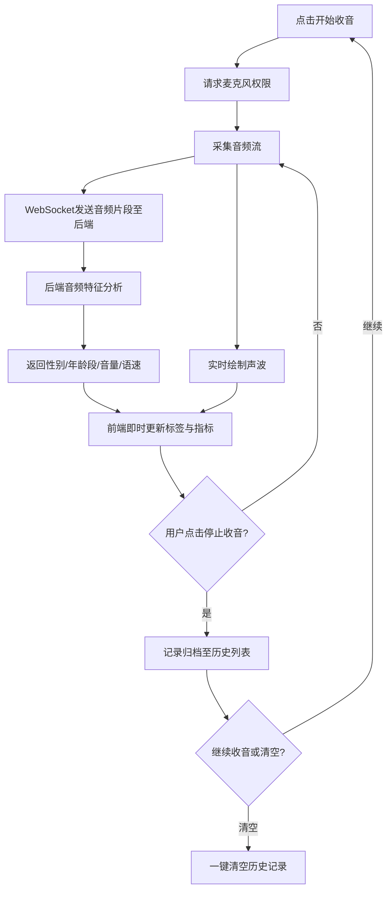

## 1. 产品概述

实时音频监测与分析平台，通过浏览器收音实现声波动态绘制，并实时判别说话人性别与大致年龄段，结果标签即时展示。支持连续收音、多条记录列表留存与一键清空，搭配音量、语速辅助展示，提供纯音频实时监测与可视化呈现的完整体验。

- 目标用户：语音研究、播音主持训练、声纹分析爱好者、教育教学场景
- 核心价值：零门槛浏览器端实时声纹分析，无需安装任何客户端

## 2. 核心功能

### 2.1 功能模块

1. **监测主页**：实时声波绘制、收音控制、性别/年龄段判别标签、音量语速辅助指标、历史记录列表、清空操作

### 2.2 页面详情

| 页面名称 | 模块名称 | 功能描述 |
|----------|----------|----------|
| 监测主页 | 声波可视化区 | 开启收音后动态绘制实时声波曲线，停止收音后波形冻结 |
| 监测主页 | 分析结果面板 | 实时展示性别标签（男/女）、年龄段标签（少年/青年/中年/老年）、置信度百分比 |
| 监测主页 | 辅助指标栏 | 实时音量条（dB）、语速指标（字/分钟） |
| 监测主页 | 收音控制栏 | 开始收音/停止收音按钮、录音时长计时器 |
| 监测主页 | 历史记录列表 | 每次收音结束后自动生成一条记录，含时间戳、性别、年龄段、音量、语速，支持一键清空 |

## 3. 核心流程

1. 用户点击"开始收音"，浏览器请求麦克风权限
2. 获取权限后，前端采集音频流，实时绘制声波至Canvas
3. 音频数据以片段形式持续发送至后端分析服务（WebSocket）
4. 后端分析音频特征（基频、能量、梅尔频率等），返回性别、年龄段、音量、语速
5. 前端即时更新标签与指标
6. 用户点击"停止收音"，本次记录归档至历史列表
7. 用户可再次点击"开始收音"进行下一轮分析
8. 用户可点击"清空记录"一键删除所有历史数据

## 4. 用户界面设计

### 4.1 设计风格

- 主色调：深邃暗色系（#0a0e1a 背景）搭配霓虹青绿（#00f5d4）与琥珀橙（#ff6b35）点缀，营造科技感监测仪表盘氛围
- 按钮风格：圆角胶囊按钮，带发光边框动效
- 字体：数字/指标使用等宽字体 JetBrains Mono，正文使用 Noto Sans SC
- 布局风格：单页仪表盘布局，上方大面积声波区域，下方左右分栏（分析结果 + 历史记录）
- 图标风格：线性描边图标（lucide-react）

### 4.2 页面设计概览

| 页面名称 | 模块名称 | UI元素 |
|----------|----------|--------|
| 监测主页 | 声波可视化区 | 深色Canvas全宽、霓虹青绿声波线、网格背景、底部时间轴 |
| 监测主页 | 分析结果面板 | 性别标签胶囊（男蓝/女粉）、年龄段标签（渐变色）、置信度环形进度条 |
| 监测主页 | 辅助指标栏 | 音量竖向柱状条（绿-黄-红渐变）、语速数字显示+单位 |
| 监测主页 | 收音控制栏 | 大圆形录音按钮（录音中脉冲动画）、计时器、状态文字 |
| 监测主页 | 历史记录列表 | 卡片式列表项、时间戳、标签组、滑动删除、清空按钮 |

### 4.3 响应式设计

- 桌面端优先设计，最小宽度1024px完整体验
- 平板端（768-1024px）声波区缩小、面板改为上下排列
- 移动端（<768px）单列布局，声波区置顶

### 4.4 动效设计

- 声波绘制：平滑曲线实时滚动，带发光拖尾效果
- 标签更新：淡入淡出切换，性别变化时颜色渐变过渡
- 录音按钮：录音中脉冲扩散光环动画
- 音量条：顶部光点流动效果
- 历史记录新增：从右侧滑入动画
