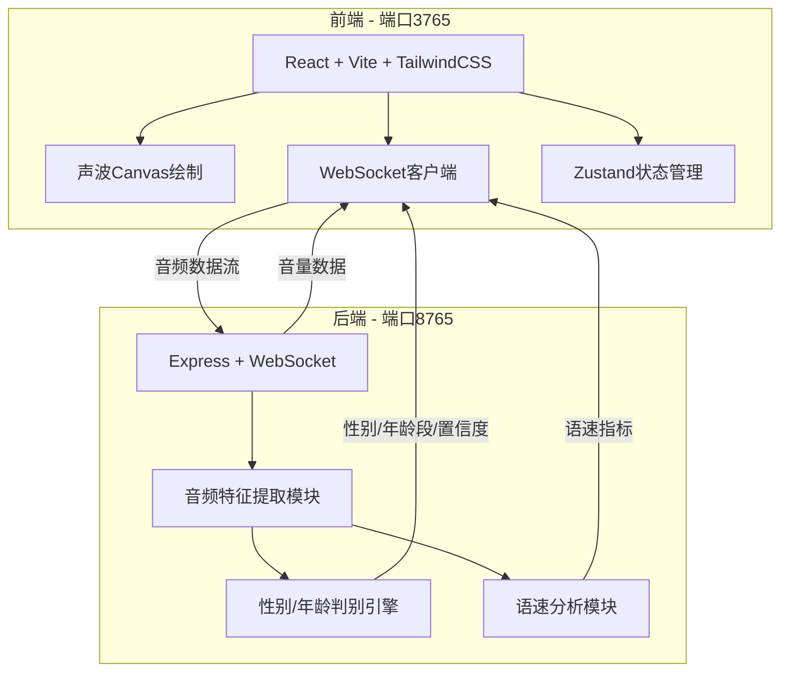
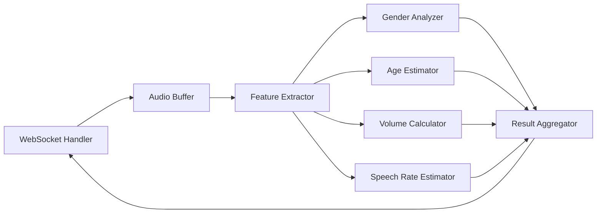

## 1. 架构设计



## 2. 技术说明

- 前端：React@18 + TypeScript + TailwindCSS@3 + Vite
- 初始化工具：vite-init（react-express-ts模板）
- 后端：Express@4 + ws（WebSocket）
- 数据库：无（前端内存状态管理，无需持久化存储）
- 音频特征提取：Web Audio API（前端采集）+ 后端DSP分析

### 音频分析算法说明

后端音频分析采用纯算法方式，无需外部AI服务：

1. **性别判别**：基于基频（F0）检测，男声基频范围约85-180Hz，女声约165-255Hz。使用自相关法（Autocorrelation）提取基频
2. **年龄段估算**：结合基频分布、语音能量包络、语谱图特征进行规则判别
3. **音量计算**：RMS（均方根）能量计算，转换为dB值
4. **语速估算**：基于短时能量过零率检测音节边界，估算每分钟音节数

## 3. 路由定义

| 路由 | 用途 |
|------|------|
| / | 监测主页，声波可视化与实时分析面板 |

## 4. API定义

### WebSocket通信协议

**连接地址**：`ws://localhost:8765/ws/audio`

#### 客户端 → 服务端

```typescript
interface AudioChunkMessage {
  type: "audio_chunk"
  data: string
  sampleRate: number
  timestamp: number
}

interface ControlMessage {
  type: "start" | "stop"
  timestamp: number
}
```

#### 服务端 → 客户端

```typescript
interface AnalysisResult {
  type: "analysis"
  gender: "male" | "female"
  genderConfidence: number
  ageGroup: "youth" | "young_adult" | "middle_aged" | "elderly"
  ageConfidence: number
  volume: number
  speechRate: number
  timestamp: number
}
```

### HTTP API

| 方法 | 路径 | 用途 |
|------|------|------|
| GET | /api/health | 健康检查 |

## 5. 服务器架构图



## 6. 数据模型

无需数据库，前端使用Zustand管理以下状态：

```typescript
interface AnalysisRecord {
  id: string
  timestamp: number
  duration: number
  gender: "male" | "female"
  genderConfidence: number
  ageGroup: "youth" | "young_adult" | "middle_aged" | "elderly"
  ageConfidence: number
  avgVolume: number
  avgSpeechRate: number
}

interface AppState {
  isRecording: boolean
  currentResult: AnalysisResult | null
  records: AnalysisRecord[]
  recordingStartTime: number | null
  addRecord: (record: AnalysisRecord) => void
  clearRecords: () => void
  setCurrentResult: (result: AnalysisResult | null) => void
  setRecording: (val: boolean) => void
}
```
